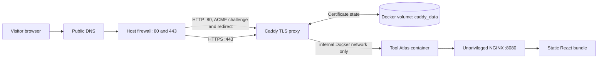

# Tool Atlas

Tool Atlas is licensed under the [Apache License 2.0](./LICENSE). The license
applies to this repository's first-party software and documentation only; it
does not grant rights to third-party vendor names, logos, installers, or other
catalog material. See [CONTRIBUTING.md](./CONTRIBUTING.md),
[SECURITY.md](./SECURITY.md), and the
[open-source readiness checklist](./docs/OPEN_SOURCE_READINESS.md)
before changing repository visibility.

Tool Atlas is a static software catalog for developers. It provides searchable software records, a second Agent Catalog for reviewed skills, agent packs, role packs, and MCP servers, support ownership, approved external or same-server downloads, and browser-rendered Markdown guides. The production Docker and IIS deployments remain backend-free and contain no application secrets.

An optional local Node.js server provides Developer Studio, an authenticated local authoring interface. It has filesystem-write APIs and an ephemeral startup token, so it is not part of the public static deployment. See [the Developer Studio guide](./docs/DEVELOPER_STUDIO.md) before using it.

The catalog supports shareable filter URLs and a saved-tools list. Saved tools and agent packages are stored only in the visitor's browser; they are never sent to a server or included in shared links.

## Run the published Docker image

The `1.7.1-beta.1` prerelease image contains only the static catalog served by unprivileged NGINX; it does not include the local Developer Studio server or its write APIs.

Pull the current release:

```bash
docker pull ghcr.io/shalevz923/shalevsoftwaresite:1.7.1-beta.1
docker run --rm --read-only --tmpfs /tmp:rw,noexec,nosuid,size=16m \
  -p 127.0.0.1:8080:8080 \
  ghcr.io/shalevz923/shalevsoftwaresite:1.7.1-beta.1
```

Then open `http://127.0.0.1:8080/`. Use the versioned tag for repeatable testing. For a production deployment, pin the reviewed image digest and use the [production deployment guide](./docs/PRODUCTION_DEPLOYMENT.md).

## Docker health, optional HTTPS, and local Studio

The default Docker image serves the static catalog; it has no Developer Studio token. Check it with `docker compose ps` or `curl --fail http://localhost/api/health` (include your `HTTP_PORT` if different). The health response is `{"status":"ok"}`. Use `docker compose logs --tail=100 app proxy` for serving/proxy logs.

`SITE_DOMAIN` and `ACME_EMAIL` can be omitted or empty. With no domain, Caddy serves HTTP on port 80. Set `SITE_DOMAIN=atlas.example.com` to enable automatic HTTPS; `ACME_EMAIL` is an optional certificate contact. See [the Docker operator guide](./docs/DOCKER_OPERATIONS.md) for startup and health commands.

For local Developer Studio in Docker, use the separate configuration:

```bash
docker compose -f compose.studio.yaml up --build --detach
docker compose -f compose.studio.yaml logs --tail=50 studio
```

Open `http://127.0.0.1:8081/?page=developer` and paste the **Developer Studio Token** from the current startup log. This container writes catalog/document changes to the mounted checkout and publishes only on localhost. Restarting it rotates the token. The public Caddy proxy has no route to Studio. Studio edits still need a reviewed rebuild/deployment before they appear in the static Docker site.

## Local development

Use Node.js 24 LTS and npm (included with Node.js). No pnpm installation is required:

```bash
npm ci
npm start
```

`npm start` builds the production app before starting the guarded loopback server at `http://127.0.0.1:8080/`. `npm run dev` and `npm run serve` also build before serving, so a fresh checkout does not require an existing `dist/` directory. Stop the server with Ctrl+C.

For separate build and startup steps:

```bash
npm run build
node scripts/server.mjs
```

The direct Node command serves an existing build; rerun `npm run build` after source changes. If you see “Application dist directory not found”, run the build from the repository root, or use `npm start`. `npm run dev:client` starts the Vite frontend without the Studio API.

On Windows, use `npm.cmd ci` and `npm.cmd start` if PowerShell blocks the `npm.ps1` shim. The Windows launcher also uses `npm.cmd` and stops if the build fails.

pnpm remains supported with `pnpm install --frozen-lockfile` and `pnpm run dev`. All package scripts also work with `npm run <script>`. When dependencies change, update and commit both `package-lock.json` and `pnpm-lock.yaml`.

Open the fragment-based access link printed at startup. The token is removed from the address bar before verification and is never accepted from a query string. Exiting the studio clears it from browser session storage.

## Sharing a tool and returning from documentation

Each tool guide has a **View in catalog** link. It opens that tool's catalog entry, expands its details, scrolls it into view, focuses its heading button, and highlights the row.

- Share JMeter's guide: `?page=documentation&tool=jmeter`
- Open JMeter directly in the catalog: `?page=catalog&tool=jmeter`
- Request a release: `?page=catalog&tool=jmeter&version=5.6.3`
- Carry a release through a guide: `?page=documentation&tool=intellij&version=2026.01-Mac`
- Open the Agent Catalog: `?page=agents`
- Open Atlas Repo MCP in the Agent Catalog: `?page=agents&agent=atlas-repo-mcp`

Append these query strings to the site's normal URL. Tool IDs and version strings must match catalog metadata exactly. Without a version, the first approved release is selected. If a version is unavailable, the tool still opens with its default release and a short explanation. A removed tool shows a notice instead of expanding an unrelated entry.

Conflicting filters are cleared so a linked tool is visible; compatible filters remain. Changing a release updates the URL and actual download target. **View documentation** retains the selected release, and **Copy view link** includes the expanded tool/version. Reload and browser Back/Forward restore these links. The documentation content itself remains the tool's shared guide; a version in its URL selects a catalog release, not a historical guide revision.

## Website version

Set `VITE_APP_VERSION=1.7.1-beta.1` in the project-root `.env` file (see `.env.example`) to control the small version label on the About page. If unset or blank, the label defaults to `1.7.1-beta.1`.

After changing it, run `pnpm build` and deploy the updated `dist/`, or restart `pnpm dev` for local use. For Docker Compose, run `docker compose --env-file .env up --build --detach`; Compose passes the value into the image build. A prebuilt image must be rebuilt with the desired version. The value is public and embedded at build time, so changing only a running server's environment will not update the label.

## Content model

Catalog source is organized for long-term ownership: [`content/catalog/<category>/<vendor>/<tool>`](./content/catalog), with a `tool.json`, `guide.md`, and one `releases/<version>.json` record per approved version. Categories are controlled by [`content/taxonomy/categories.json`](./content/taxonomy/categories.json), so a new category is an explicit, reviewed taxonomy change—not a spelling variation. Add a tool interactively with `pnpm catalog:add`, or edit its source directory and run `pnpm catalog:build`. The generated app data in `src/generated/catalog.ts` and the machine feed in `public/catalog/v1/` are checked into Git and must not be edited by hand. Machine clients read `/catalog/v1/index.json` and `/catalog/v1/tools.json`; see [the machine catalog contract](./docs/CATALOG_MACHINE_FEED.md).

The Agent Catalog is a parallel source tree: [`content/agents/<type>/<publisher>/<package>`](./content/agents), with `agent.json`, `guide.md`, and per-version ZIP release records. Types are controlled by [`content/taxonomy/agent-types.json`](./content/taxonomy/agent-types.json). Edit a package directory and run `pnpm agents:build`. The generated app data in `src/generated/agents.ts` is also checked into Git. Listings ship a hashed ZIP on `/downloads` and an unpack path for project or global scope. MCP servers may add a VS Code `vscode:mcp/install` link only for stdio binaries or internal HTTPS endpoints. Users do not need Node or npm. Tool Atlas indexes and validates those packages; it does not execute their scripts. On air-gapped GitLab, follow [the air-gapped Agent Catalog guide](./docs/AIRGAPPED_AGENT_CATALOG.md).

Every software entry has a stable ID, ownership details, platform/lifecycle metadata, one approved target per release, tags, and a guide containing `## Install` and `## Support`. A target can be a trusted HTTPS URL or a same-server artifact pointer such as `intellij/2025.1/ideaIU-2025.1.exe`. The validator rejects duplicate IDs/orders, unsafe URLs or artifact paths, remote guide images, invalid support details, and credential-like fact labels.

For browser-based contribution, open the **Add software to the catalog** GitHub Issue Form. A maintainer reviews the submission and applies the `catalog-approved` label; only then does the workflow create a validated pull request for normal review and merge. GitLab projects receive the matching Issue Template and an approval-gated manual CI job that creates a merge request. See [CATALOG_CONTENT_GUIDE.md](./CATALOG_CONTENT_GUIDE.md) for both paths and the [GitLab catalog contribution guide](./docs/GITLAB_CATALOG_CONTRIBUTION.md) for the one-time setup and operating steps.

For copy-paste examples, images, optional catalog facts such as license references, and the safety boundary for sensitive values, see [CATALOG_CONTENT_GUIDE.md](./CATALOG_CONTENT_GUIDE.md). For agent packages, see [AGENT_CATALOG_CONTENT_GUIDE.md](./AGENT_CATALOG_CONTENT_GUIDE.md).

The production-oriented source boundaries, catalog hierarchy, taxonomy expansion policy, and operating rules are documented in [docs/PROJECT_STRUCTURE.md](./docs/PROJECT_STRUCTURE.md).

## Release gate

```bash
pnpm verify
pnpm audit --prod
```

`pnpm verify` runs unit tests, builds the production bundle, and validates the generated `dist/` artifact. Deploy only the contents of `dist/`.

`public/_headers` is copied to `dist/_headers` for Cloudflare Pages and Netlify-compatible static hosting. For other hosts, apply the equivalent response headers at the CDN or web-server layer before production promotion.

## Production deployment with Docker and HTTPS

The included Compose deployment keeps the static app private on an internal Docker network and exposes only Caddy, which obtains and renews a public ACME TLS certificate automatically. Set `SITE_DOMAIN` to enable HTTPS. Without a domain, Caddy serves HTTP for local/trusted network access. Optional configuration is read from a host-local `.env` file; it is intentionally ignored by Git.



### 1. Prepare the host

- Use a supported Linux host with Docker Engine and the Docker Compose plugin.
- Create a public DNS `A` (and, if used, `AAAA`) record for the intended hostname pointing at the host.
- Allow inbound TCP **80** and **443** only. Do not publish the app's port `8080`.
- Do not place another proxy on ports 80/443 unless it forwards both ports to this host; Caddy needs port 80 for ACME HTTP validation and redirect handling.

### 2. Configure the environment

For production HTTPS, copy the template and set the hostname and any optional deployment values:

```bash
cp .env.example .env
chmod 600 .env
```

`.env` controls the deployment without changing tracked files:

| Variable | Required | Purpose |
| --- | --- | --- |
| `SITE_DOMAIN` | For HTTPS | Public hostname, without `https://`, a path, or a port. Empty uses HTTP on port 80. |
| `ACME_EMAIL` | No | Optional contact address supplied to the ACME CA. |
| `HTTP_PORT` | No | Host HTTP port; use `80` in production. |
| `HTTPS_PORT` | No | Host HTTPS port; use `443` in production. |

The static production app has no application secrets and does not consume browser-visible runtime variables. Keep credentials out of Vite variables (`VITE_*` values are compiled into public JavaScript). The optional Developer Studio token belongs only to its local Node.js process and must not be added to a static deployment.

### 3. Build and start

Validate the resolved configuration before starting it, then build and run the stack:

```bash
docker compose --env-file .env config
docker compose --env-file .env up --build --detach
docker compose --env-file .env ps
```

For same-server installers, create `packages/<tool-id>/<version>/` on the host and put only reviewed files there. The directory is ignored by Git and mounted read-only into NGINX; catalog metadata uses `artifact:<tool-id>/<version>/<filename>`. Publish the file before deploying the catalog reference. NGINX disables directory listing, rejects unapproved path shapes/extensions, and forces successful file responses to download as attachments.

Caddy requests the certificate after DNS and firewall access are correct. Follow its startup until it reports successful certificate management:

```bash
docker compose --env-file .env logs --follow proxy
```

Verify the public endpoint from a separate network when possible:

```bash
curl --fail --show-error --head "https://YOUR_PRODUCTION_DOMAIN"
curl --fail --show-error --head "http://YOUR_PRODUCTION_DOMAIN"
```

The HTTP check should redirect to HTTPS. The HTTPS response should include `Strict-Transport-Security`, `Content-Security-Policy`, `X-Content-Type-Options`, and `X-Frame-Options`.

### 4. Operate safely

- Certificates renew automatically; retain and back up the Docker volumes `tool-atlas_caddy_data` and `tool-atlas_caddy_config`. Losing them can trigger new certificate issuance and ACME rate limits.
- For an app update, run `pnpm verify`, build a reviewed image, and then run `docker compose --env-file .env up --build --detach`. The tracked base and proxy images are pinned to immutable digests; update those pins only through a reviewed vulnerability/provenance check.
- For a hostname change, update `SITE_DOMAIN`, verify the new DNS record, then run the same `up` command. Caddy will obtain a certificate for the new hostname.
- Inspect the live state with `docker compose --env-file .env ps` and `docker compose --env-file .env logs proxy app`. Caddy writes JSON access logs (including `/downloads/…`) to stdout. NGINX writes JSON access and error logs to the app container stdout/stderr. Do not copy `.env` into an image or commit it.

The app container runs as the unprivileged `nginx` user with a read-only filesystem, a small writable temporary filesystem, no Linux capabilities, and no host port. The proxy is the only public container; it has only the capability needed to bind HTTP(S) ports and persists certificate state in named volumes.

See [the deployment security report](docs/SECURITY_REPORT.md) for the scope, verified controls, and remaining operational risks.

For the `v1.7.1-beta.1` GHCR image, digest-pinning, rollback, CI evidence, and the Windows Server decision, follow the [production deployment guide](docs/PRODUCTION_DEPLOYMENT.md).

The catalog website remains backend-free. A separate Tool Atlas MCP image can search `/catalog/v1` for IDEs. It is not packed into the NGINX image. See [the machine catalog contract](docs/CATALOG_MACHINE_FEED.md).

To see the same-server download path working locally with a real, checksum-verified Windows executable, follow the [hosted-download guide](docs/HOSTED_DOWNLOADS.md). It uses a pinned PowerShell publisher container and exposes the production application only on `127.0.0.1:8080`.

## Windows Server or workstation deployment

The Windows deployment uses IIS as the operating-system-managed web service. The site and installer directory remain static: IIS provides service recovery, W3C access logs, Windows Event Log diagnostics, and forced attachment downloads without adding an application backend. Follow the complete [Windows deployment and operations guide](docs/WINDOWS_DEPLOYMENT.md).
