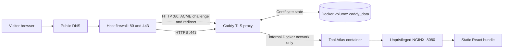

# Tool Atlas

Tool Atlas is a static software catalog for developers. It provides searchable software records, support ownership, approved external or same-server downloads, and browser-rendered Markdown guides. It has no backend, account system, or application secrets.

The catalog supports shareable filter URLs and a saved-tools list. Saved tools are stored only in the visitor's browser; they are never sent to a server or included in shared links.

## Local development

```bash
pnpm install --frozen-lockfile
pnpm dev
```

## Content model

Each tool lives in one file under [`content/tools`](./content/tools): JSON metadata followed by its Markdown guide. Add a tool interactively with `pnpm catalog:add`, or edit one existing file and run `pnpm catalog:build`. The generated app data in `src/generated/catalog.ts` is checked into Git and must not be edited by hand.

Every entry has a stable ID, ownership details, platform/lifecycle metadata, one approved target per release, tags, and a guide containing `## Install` and `## Support`. A target can be a trusted HTTPS URL or a same-server artifact pointer such as `intellij/2025.1/ideaIU-2025.1.exe`. The validator rejects duplicate IDs/orders, unsafe URLs or artifact paths, remote guide images, invalid support details, and credential-like fact labels.

For browser-based contribution, open the **Add software to the catalog** GitHub Issue Form. A maintainer reviews the submission and applies the `catalog-approved` label; only then does the workflow create a validated pull request for normal review and merge. GitLab projects receive the matching Issue Template and an approval-gated manual CI job that creates a merge request. See [CATALOG_CONTENT_GUIDE.md](./CATALOG_CONTENT_GUIDE.md) for both paths and the [GitLab catalog contribution guide](./docs/GITLAB_CATALOG_CONTRIBUTION.md) for the one-time setup and operating steps.

For copy-paste examples, images, optional catalog facts such as license references, and the safety boundary for sensitive values, see [CATALOG_CONTENT_GUIDE.md](./CATALOG_CONTENT_GUIDE.md).

## Release gate

```bash
pnpm verify
pnpm audit --prod
```

`pnpm verify` runs unit tests, builds the production bundle, and validates the generated `dist/` artifact. Deploy only the contents of `dist/`.

`public/_headers` is copied to `dist/_headers` for Cloudflare Pages and Netlify-compatible static hosting. For other hosts, apply the equivalent response headers at the CDN or web-server layer before production promotion.

## Production deployment with Docker and HTTPS

The included Compose deployment keeps the static app private on an internal Docker network and exposes only Caddy, which obtains and renews a public ACME TLS certificate automatically. Configuration is read from a host-local `.env` file; it is intentionally ignored by Git.



### 1. Prepare the host

- Use a supported Linux host with Docker Engine and the Docker Compose plugin.
- Create a public DNS `A` (and, if used, `AAAA`) record for the intended hostname pointing at the host.
- Allow inbound TCP **80** and **443** only. Do not publish the app's port `8080`.
- Do not place another proxy on ports 80/443 unless it forwards both ports to this host; Caddy needs port 80 for ACME HTTP validation and redirect handling.

### 2. Configure the environment

Copy the template and replace every example value with the production values:

```bash
cp .env.example .env
chmod 600 .env
```

`.env` controls the deployment without changing tracked files:

| Variable | Required | Purpose |
| --- | --- | --- |
| `SITE_DOMAIN` | Yes | Public hostname, without `https://`, a path, or a port. |
| `ACME_EMAIL` | Yes | Certificate-expiry/contact address supplied to the ACME CA. |
| `HTTP_PORT` | No | Host HTTP port; use `80` in production. |
| `HTTPS_PORT` | No | Host HTTPS port; use `443` in production. |

This static app has no application secrets and does not consume browser-visible runtime variables. Keep future credentials out of Vite variables (`VITE_*` values are compiled into public JavaScript); use a server-side secret mechanism if a backend is later introduced.

### 3. Build and start

Validate the resolved configuration before starting it, then build and run the stack:

```bash
docker compose --env-file .env config
docker compose --env-file .env up --build --detach
docker compose --env-file .env ps
```

For same-server installers, create `packages/<tool-id>/<version>/` on the host and put only reviewed files there. The directory is ignored by Git and mounted read-only into NGINX; catalog metadata uses `artifact:<tool-id>/<version>/<filename>`. Publish the file before deploying the catalog reference. NGINX disables directory listing, rejects unapproved path shapes/extensions, and forces successful file responses to download as attachments.

Caddy requests the certificate after DNS and firewall access are correct. Follow its startup until it reports successful certificate management:

```bash
docker compose --env-file .env logs --follow proxy
```

Verify the public endpoint from a separate network when possible:

```bash
curl --fail --show-error --head "https://YOUR_PRODUCTION_DOMAIN"
curl --fail --show-error --head "http://YOUR_PRODUCTION_DOMAIN"
```

The HTTP check should redirect to HTTPS. The HTTPS response should include `Strict-Transport-Security`, `Content-Security-Policy`, `X-Content-Type-Options`, and `X-Frame-Options`.

### 4. Operate safely

- Certificates renew automatically; retain and back up the Docker volumes `tool-atlas_caddy_data` and `tool-atlas_caddy_config`. Losing them can trigger new certificate issuance and ACME rate limits.
- For an app update, run `pnpm verify`, build a reviewed image, and then run `docker compose --env-file .env up --build --detach`. The tracked base and proxy images are pinned to immutable digests; update those pins only through a reviewed vulnerability/provenance check.
- For a hostname change, update `SITE_DOMAIN`, verify the new DNS record, then run the same `up` command. Caddy will obtain a certificate for the new hostname.
- Inspect the live state with `docker compose --env-file .env ps` and `docker compose --env-file .env logs proxy app`. Do not copy `.env` into an image or commit it.

The app container runs as the unprivileged `nginx` user with a read-only filesystem, a small writable temporary filesystem, no Linux capabilities, and no host port. The proxy is the only public container; it has only the capability needed to bind HTTP(S) ports and persists certificate state in named volumes.

See [the deployment security report](docs/SECURITY_REPORT.md) for the scope, verified controls, and remaining operational risks.

## Windows Server or workstation deployment

The Windows deployment uses IIS as the operating-system-managed web service. The site and installer directory remain static: IIS provides service recovery, W3C access logs, Windows Event Log diagnostics, and forced attachment downloads without adding an application backend. Follow the complete [Windows deployment and operations guide](docs/WINDOWS_DEPLOYMENT.md).
